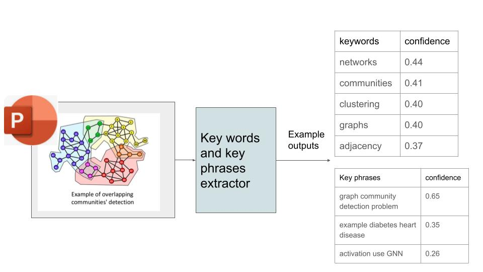

Search a **keyword** from powerpoint slides from a folder
---
Script: search_keywords_from_pptx_slides.py.

Input: folder name, keyword.

Note: keyword has to be the exact match.

run code from the command line:

```sh
python search_keywords_from_pptx_slides.py PPTXFOLDER keyword

```

Completed: filter out files in the specified folder that are not ppt slides.

Check: 
package can't read tmp/hidden file, for example: Folder\~$**.pptx


**Keyword and Keyphrase summarization** from powerpoint slide (pptx)
--
Script: extract_words_from_pptx.py

run code from the command line:

```sh
python extract_words_from_pptx.py
```

Sample results 



input slides is from https://luoluo-l.github.io/files/sbm_gnn.pdf

